# POC-06: AI Agents Learning Platform - Detailed Architecture

## Table of Contents
1. [System Architecture](#system-architecture)
2. [Component Details](#component-details)
3. [Data Flow Diagrams](#data-flow-diagrams)
4. [Agent Execution Patterns](#agent-execution-patterns)
5. [Integration Patterns](#integration-patterns)
6. [Deployment Architecture](#deployment-architecture)

---

## System Architecture

### Complete System Architecture

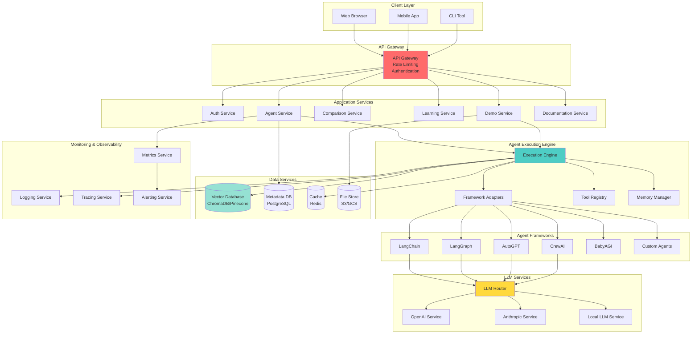

---

## Component Details

### Agent Service Architecture

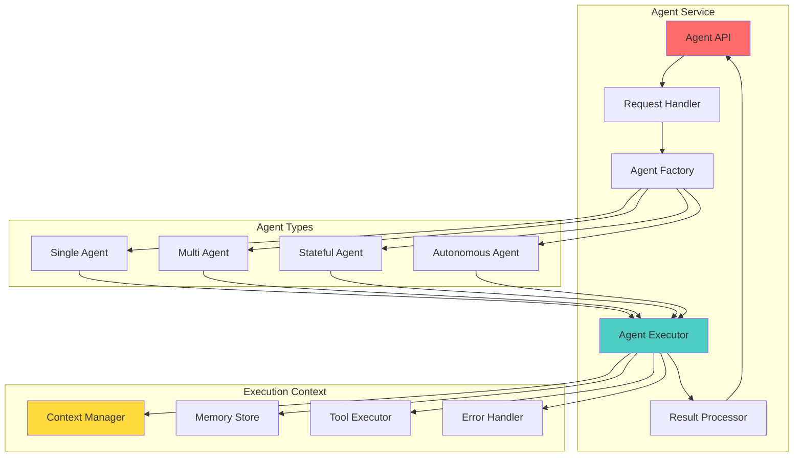

### LLM Router Architecture

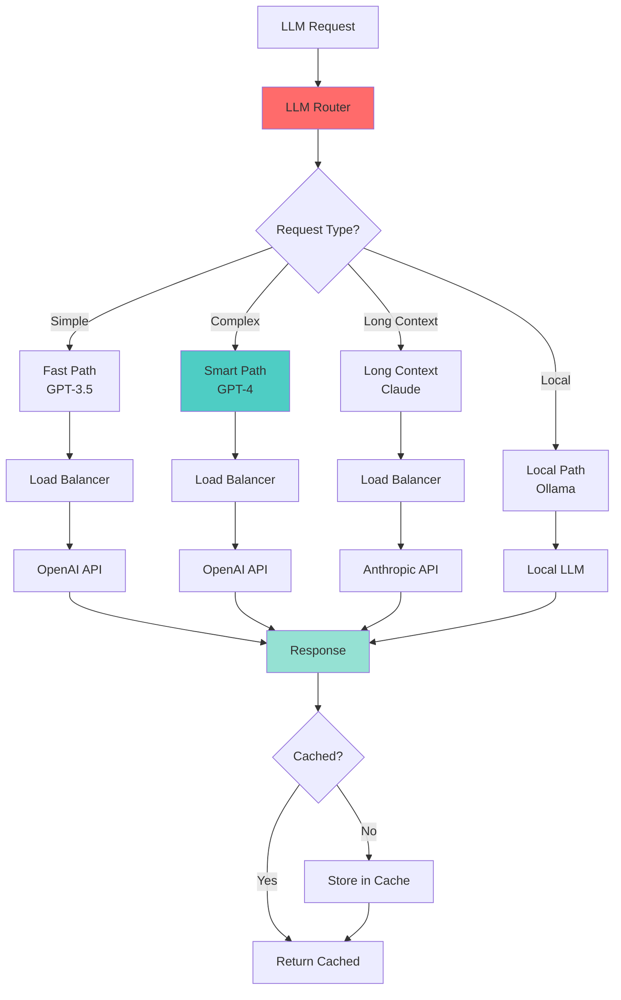

---

## Data Flow Diagrams

### Complete Request Flow

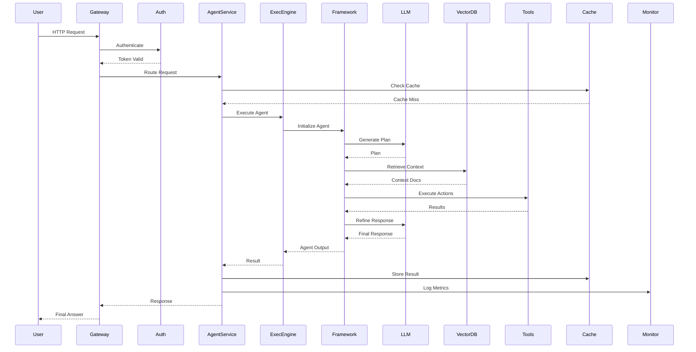

### Agent Execution Flow with Error Handling

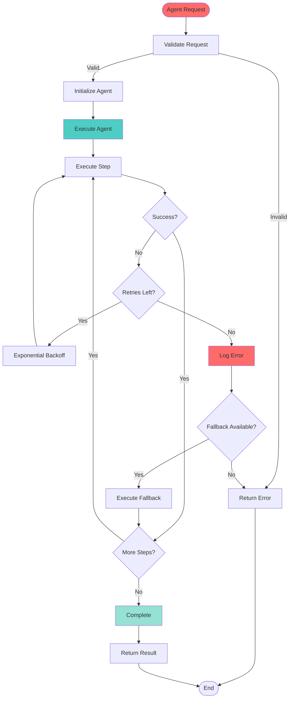

---

## Agent Execution Patterns

### Pattern 1: Simple Agent (LangChain)

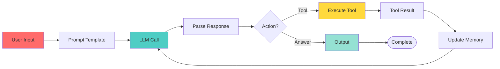

### Pattern 2: Stateful Agent (LangGraph)

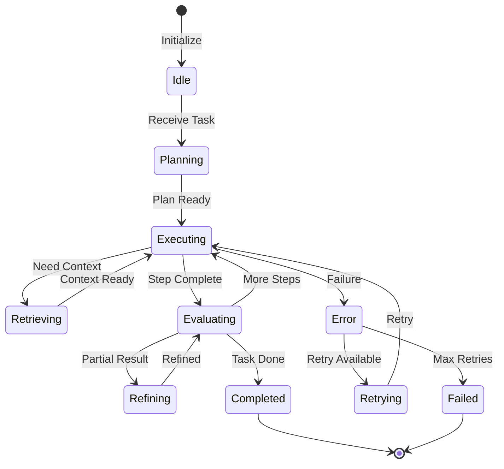

### Pattern 3: Multi-Agent System (CrewAI)

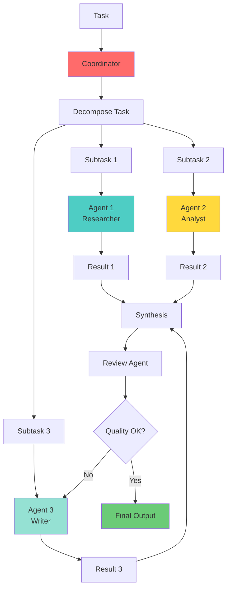

### Pattern 4: Autonomous Agent (AutoGPT)

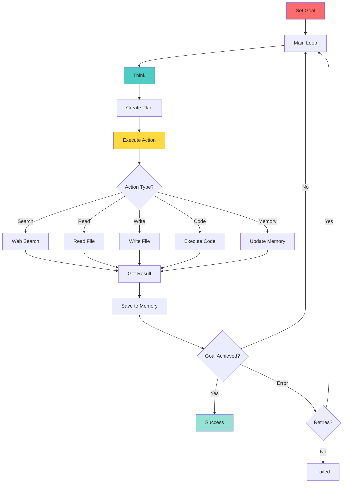

---

## Integration Patterns

### RAG Integration Pattern

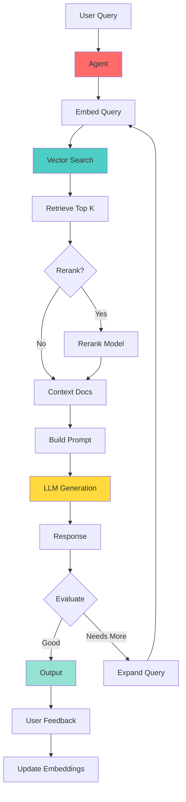

### Tool Integration Pattern

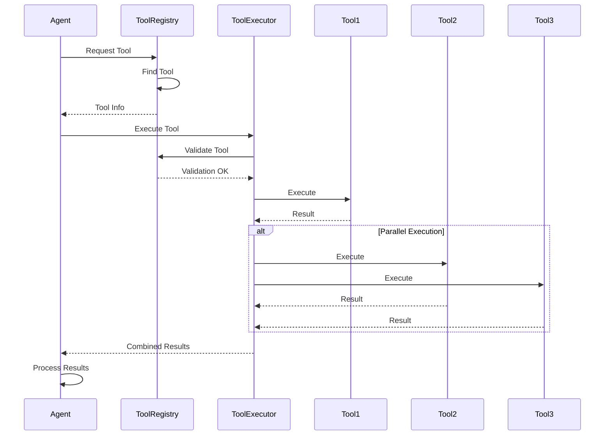

---

## Deployment Architecture

### Production Deployment

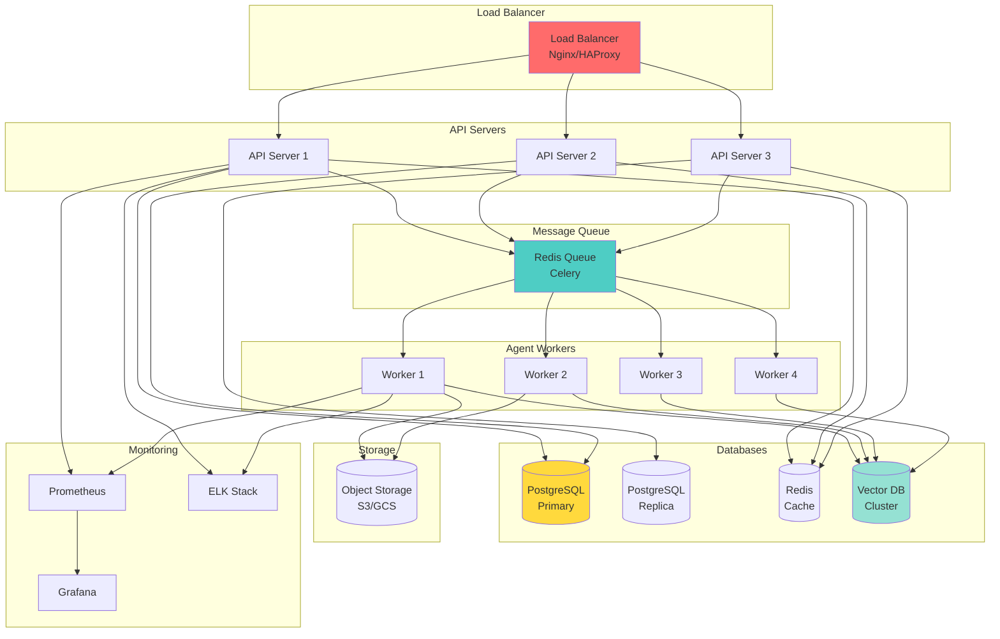

### Container Architecture

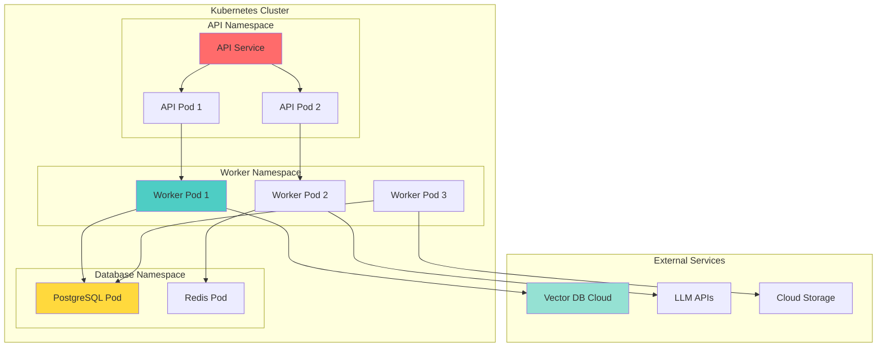

---

*This architecture document provides detailed technical specifications for the AI Agents Learning Platform POC.*

