# POC-06: AI Agents Learning Platform
## World-Class Proof of Concept Documentation

---

## Table of Contents

1. [Executive Summary](#executive-summary)
2. [What is a World-Class POC?](#what-is-a-world-class-poc)
3. [POC Objectives](#poc-objectives)
4. [Architecture Overview](#architecture-overview)
5. [Tool & Technology Selection](#tool--technology-selection)
6. [AI Agents Ecosystem](#ai-agents-ecosystem)
7. [Detailed Architecture](#detailed-architecture)
8. [Implementation Flows](#implementation-flows)
9. [Comparison Matrices](#comparison-matrices)
10. [Success Criteria](#success-criteria)
11. [Roadmap](#roadmap)

---

## Executive Summary

### Vision
Build a comprehensive AI Agents Learning Platform that serves as a centralized knowledge hub for understanding, comparing, and learning about all AI agents, agentic systems, LLM orchestration tools, and related technologies in the current market.

### Mission
Create an interactive, educational platform that:
- Maps the entire AI agents ecosystem
- Provides detailed comparisons of tools and frameworks
- Offers hands-on learning experiences
- Serves as a reference guide for AI agent technologies
- Demonstrates real-world agent implementations

### Key Value Propositions
1. **Comprehensive Coverage**: All major AI agent frameworks and tools
2. **Interactive Learning**: Hands-on demos and examples
3. **Visual Understanding**: Rich diagrams and flowcharts
4. **Practical Guidance**: Use case recommendations and decision matrices
5. **Market Intelligence**: Current state of AI agent technologies

---

## What is a World-Class POC?

### Definition
A **Proof of Concept (POC)** is a demonstration that verifies a concept or theory has practical potential. A **world-class POC** goes beyond basic validation to:

### Characteristics of World-Class POC

| Characteristic | Description | Why It Matters |
|----------------|-------------|----------------|
| **Clear Objectives** | Well-defined goals and success criteria | Ensures focused development and measurable outcomes |
| **Production-Ready Architecture** | Scalable, maintainable design patterns | Demonstrates real-world viability |
| **Comprehensive Documentation** | Detailed technical and user documentation | Enables knowledge transfer and adoption |
| **Visual Communication** | Rich diagrams, flows, and visualizations | Facilitates understanding and stakeholder buy-in |
| **Tool Justification** | Detailed rationale for technology choices | Shows thoughtful decision-making |
| **Alternative Analysis** | Comparison with competing solutions | Demonstrates market awareness |
| **Extensibility** | Designed for future enhancements | Shows long-term thinking |
| **Performance Metrics** | Defined KPIs and measurement criteria | Enables objective evaluation |
| **Risk Assessment** | Identified risks and mitigation strategies | Shows maturity and planning |
| **Stakeholder Value** | Clear business and technical value | Ensures alignment with goals |

### POC vs MVP vs Production

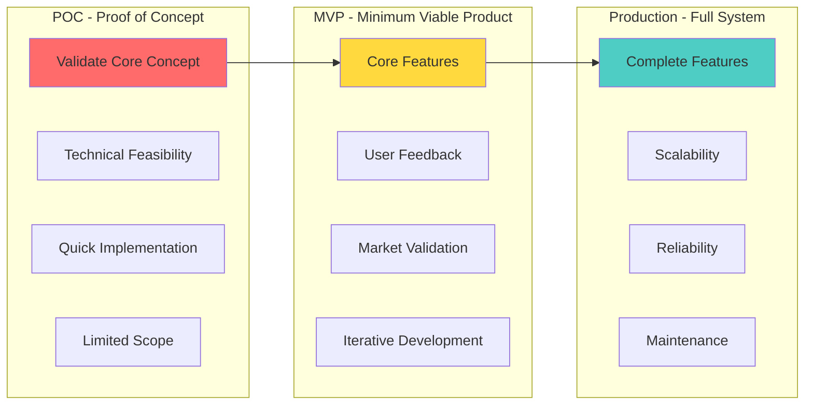

### Our POC Approach

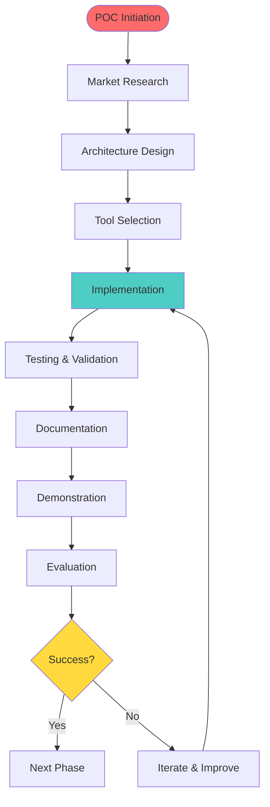

---

## POC Objectives

### Primary Objectives

1. **Comprehensive AI Agents Mapping**
   - Catalog all major AI agent frameworks
   - Document agent architectures and patterns
   - Create visual ecosystem maps

2. **Interactive Learning Platform**
   - Build hands-on demos for each agent type
   - Provide code examples and tutorials
   - Create comparison tools

3. **Market Intelligence**
   - Current state of AI agent technologies
   - Tool comparison matrices
   - Use case recommendations

4. **Technical Excellence**
   - Production-ready architecture
   - Scalable design patterns
   - Best practices implementation

### Success Metrics

| Metric | Target | Measurement |
|--------|--------|-------------|
| **Agent Frameworks Covered** | 20+ | Count of documented frameworks |
| **Interactive Demos** | 15+ | Number of working demos |
| **Comparison Tables** | 10+ | Number of comparison matrices |
| **Architecture Diagrams** | 30+ | Number of visual diagrams |
| **Code Examples** | 50+ | Number of code samples |
| **Documentation Pages** | 100+ | Pages of documentation |
| **Response Time** | <2s | Average query response |
| **User Satisfaction** | >90% | User feedback score |

---

## Architecture Overview

### High-Level Architecture

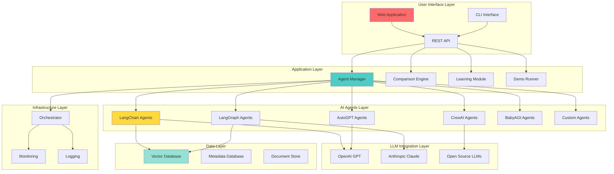

### System Components

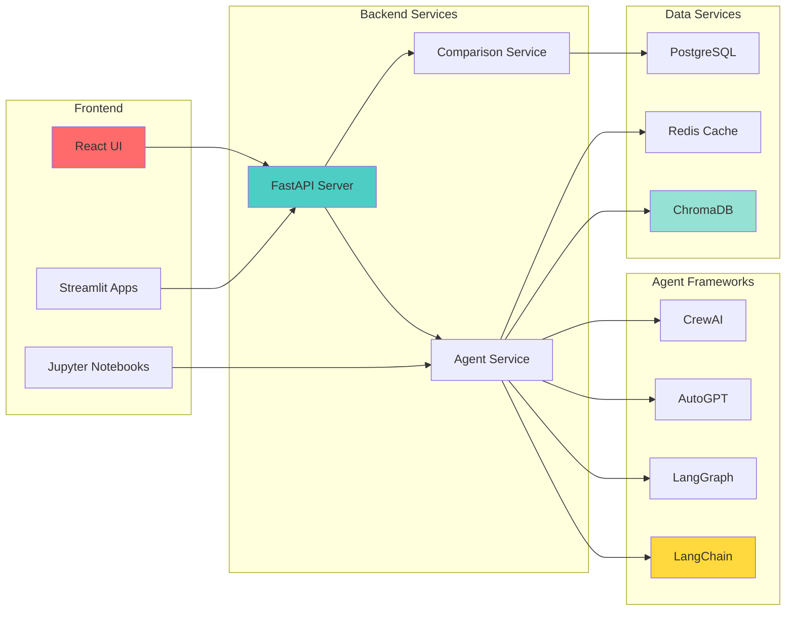

---

## Tool & Technology Selection

### Selection Criteria

| Criterion | Weight | Description |
|-----------|--------|-------------|
| **Functionality** | 30% | Does it meet requirements? |
| **Community Support** | 20% | Active community and documentation |
| **Performance** | 15% | Speed and efficiency |
| **Ease of Use** | 15% | Learning curve and developer experience |
| **Cost** | 10% | Licensing and operational costs |
| **Scalability** | 10% | Ability to scale with growth |

### Technology Stack

#### Frontend Technologies

| Technology | Purpose | Alternative | Why Chosen |
|------------|---------|-------------|------------|
| **React** | Main web UI | Vue.js, Angular | Large ecosystem, component reusability |
| **Streamlit** | Quick demos | Gradio, Dash | Rapid prototyping, Python-native |
| **D3.js** | Visualizations | Chart.js, Plotly | Rich interactive visualizations |
| **TypeScript** | Type safety | JavaScript | Better developer experience |

#### Backend Technologies

| Technology | Purpose | Alternative | Why Chosen |
|------------|---------|-------------|------------|
| **FastAPI** | API server | Flask, Django | High performance, async support, auto docs |
| **Python 3.11+** | Main language | Node.js, Go | Rich AI/ML ecosystem |
| **PostgreSQL** | Metadata DB | MySQL, MongoDB | ACID compliance, JSON support |
| **Redis** | Caching | Memcached | Advanced data structures, pub/sub |

#### AI Agent Frameworks

| Framework | Purpose | Alternative | Why Chosen |
|-----------|---------|-------------|------------|
| **LangChain** | Agent orchestration | LlamaIndex, Haystack | Most popular, comprehensive |
| **LangGraph** | Stateful agents | Custom solutions | Advanced agent workflows |
| **AutoGPT** | Autonomous agents | BabyAGI, AgentGPT | Self-directed agent patterns |
| **CrewAI** | Multi-agent systems | AutoGen, Swarm | Collaborative agent patterns |

#### LLM Providers

| Provider | Purpose | Alternative | Why Chosen |
|----------|---------|-------------|------------|
| **OpenAI GPT-4** | Primary LLM | Claude, Gemini | Best performance, reliability |
| **Anthropic Claude** | Alternative LLM | GPT-3.5, Llama | Long context, safety |
| **Ollama** | Local LLMs | LM Studio, vLLM | Privacy, cost control |

#### Vector Databases

| Database | Purpose | Alternative | Why Chosen |
|----------|---------|-------------|------------|
| **ChromaDB** | Primary vector DB | Pinecone, Weaviate | Easy setup, open source |
| **Pinecone** | Managed option | Qdrant, Milvus | Production-ready, managed |
| **FAISS** | Local search | Annoy, ScaNN | Fast, Facebook-backed |

### Technology Decision Tree

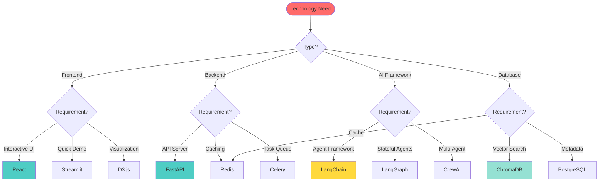

---

## AI Agents Ecosystem

### Complete AI Agents Landscape

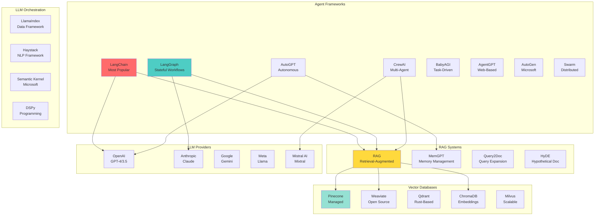

### Agent Types Classification

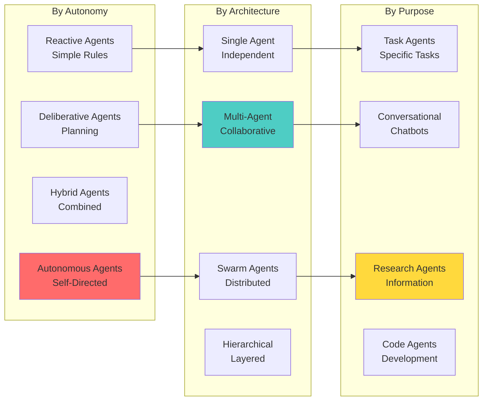

### Agent Framework Comparison

| Framework | Type | Language | Key Features | Best For |
|-----------|------|----------|--------------|----------|
| **LangChain** | Orchestration | Python/JS | Chains, Agents, Memory | General purpose agents |
| **LangGraph** | Stateful | Python | State machines, Cycles | Complex workflows |
| **AutoGPT** | Autonomous | Python | Self-prompting, Goals | Research, automation |
| **BabyAGI** | Task-driven | Python | Task queue, Objectives | Task management |
| **CrewAI** | Multi-agent | Python | Roles, Tasks, Collaboration | Team-based tasks |
| **AgentGPT** | Web-based | TypeScript | Browser-based, Simple | Quick prototyping |
| **AutoGen** | Multi-agent | Python | Conversational, Code | Code generation |
| **LlamaIndex** | Data-focused | Python | Data connectors, RAG | Data applications |

---

## Detailed Architecture

### Agent Execution Flow

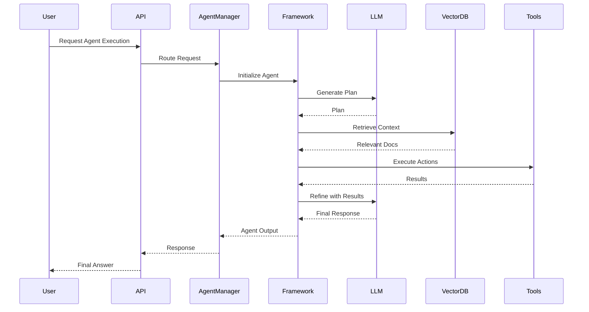

### Multi-Agent Collaboration Flow

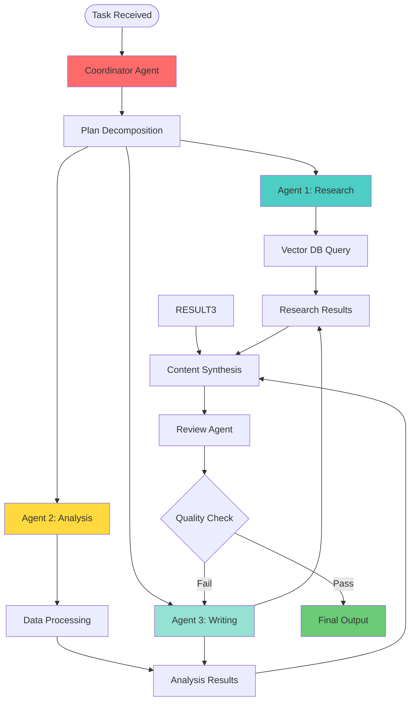

### RAG-Enhanced Agent Flow

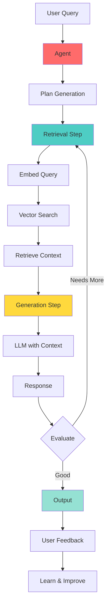

### State Management in Agents

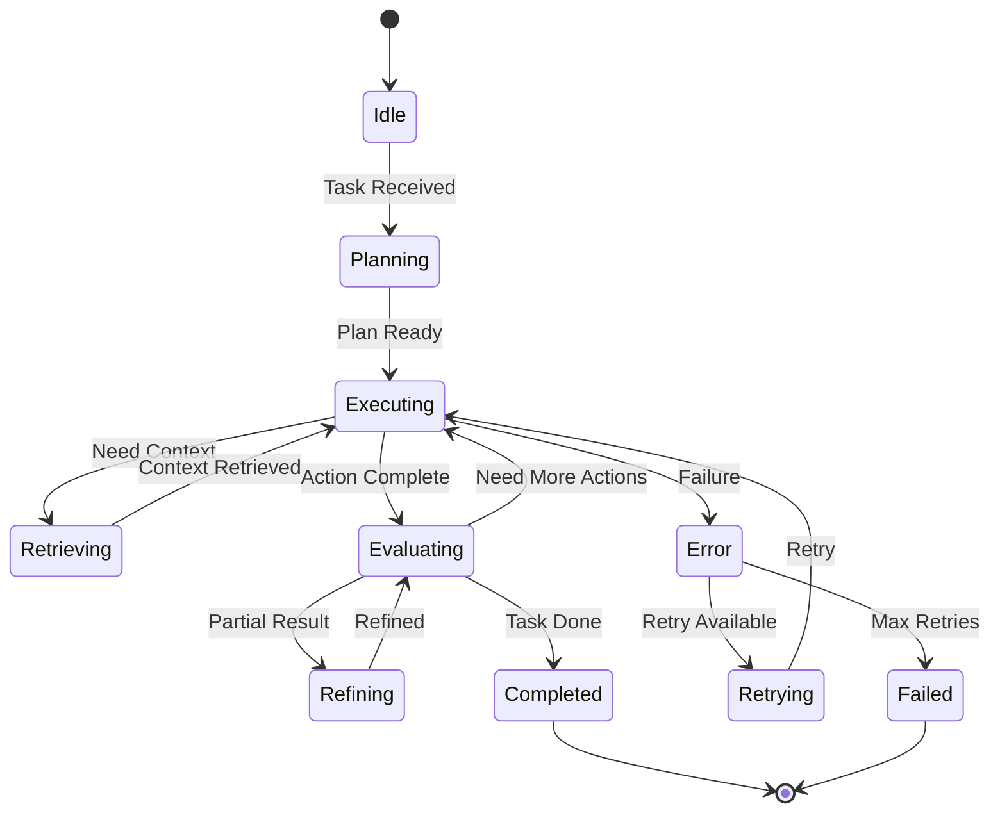

---

## Implementation Flows

### LangChain Agent Flow

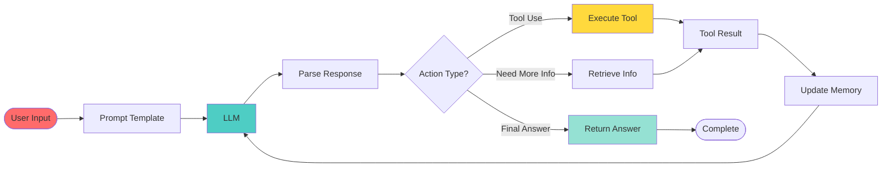

### LangGraph Stateful Agent Flow

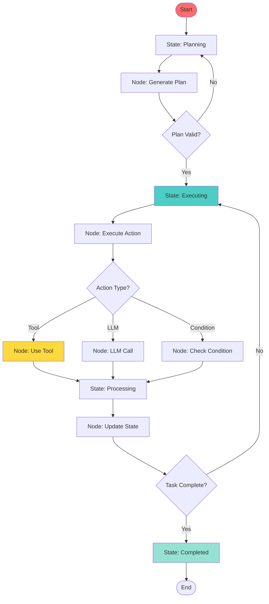

### AutoGPT Autonomous Agent Flow

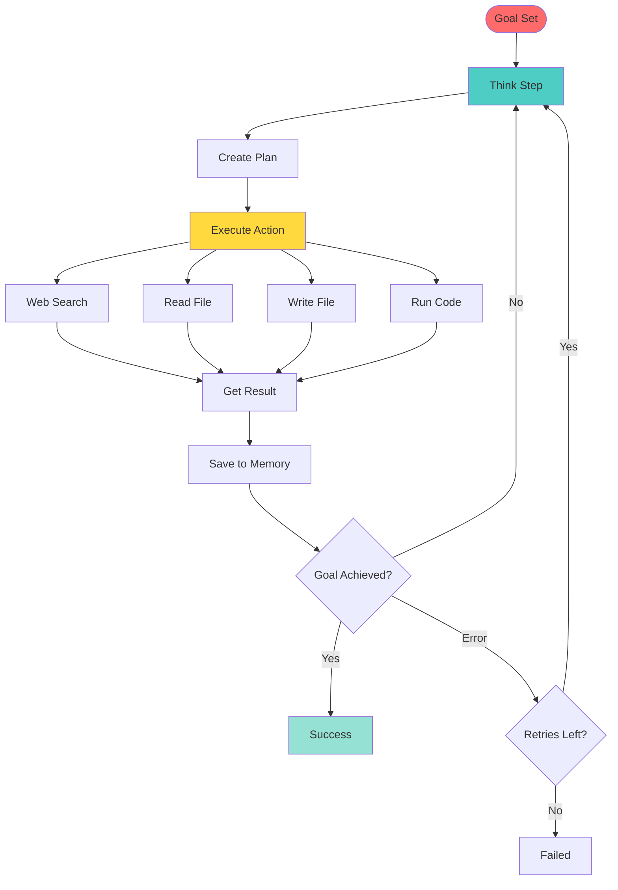

### CrewAI Multi-Agent Flow

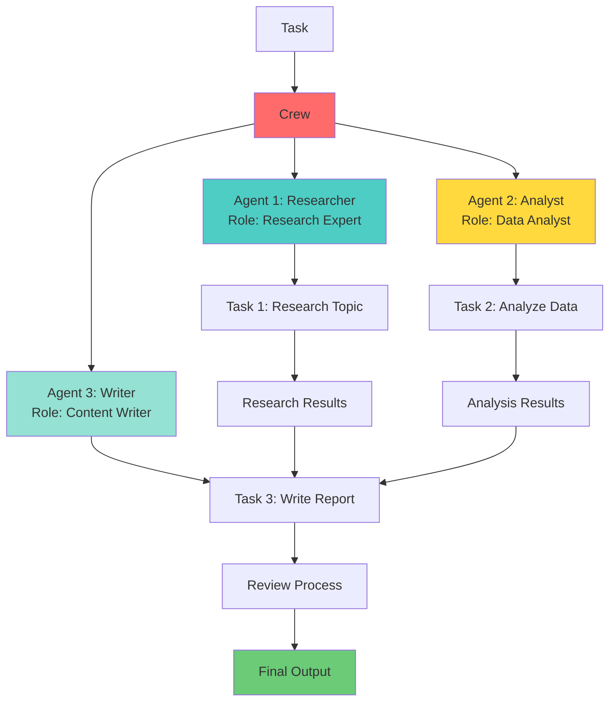

---

## Comparison Matrices

### Agent Framework Feature Comparison

| Feature | LangChain | LangGraph | AutoGPT | CrewAI | BabyAGI | AutoGen |
|---------|-----------|-----------|---------|--------|---------|---------|
| **Agent Types** | Single, Multi | Stateful | Autonomous | Multi-agent | Task-driven | Conversational |
| **State Management** | Basic | Advanced | Memory-based | Role-based | Queue-based | Conversation |
| **Tool Integration** | ✅ Excellent | ✅ Good | ✅ Good | ✅ Good | ⚠️ Limited | ✅ Good |
| **Memory** | ✅ Built-in | ✅ State | ✅ Long-term | ⚠️ Limited | ✅ Task memory | ✅ Conversation |
| **Multi-Agent** | ⚠️ Basic | ✅ Yes | ❌ No | ✅ Excellent | ❌ No | ✅ Yes |
| **Learning Curve** | Medium | Medium-High | High | Medium | Medium | Medium |
| **Documentation** | ⭐⭐⭐⭐⭐ | ⭐⭐⭐⭐ | ⭐⭐⭐ | ⭐⭐⭐⭐ | ⭐⭐⭐ | ⭐⭐⭐⭐ |
| **Community** | ⭐⭐⭐⭐⭐ | ⭐⭐⭐⭐ | ⭐⭐⭐ | ⭐⭐⭐ | ⭐⭐⭐ | ⭐⭐⭐⭐ |
| **Best For** | General purpose | Complex workflows | Research | Team tasks | Task management | Code generation |

### LLM Provider Comparison

| Provider | Model | Context | Cost | Speed | Best For |
|----------|-------|---------|------|-------|----------|
| **OpenAI** | GPT-4 | 128K | High | Fast | Production, reliability |
| **OpenAI** | GPT-3.5 | 16K | Medium | Very Fast | Development, cost-effective |
| **Anthropic** | Claude 3 | 200K | High | Fast | Long context, safety |
| **Google** | Gemini Pro | 32K | Medium | Fast | Multimodal, Google ecosystem |
| **Meta** | Llama 2/3 | Variable | Free | Medium | Open source, privacy |
| **Mistral** | Mixtral | 32K | Low | Fast | Cost-effective, open |

### Vector Database Comparison

| Database | Type | Scalability | Performance | Cost | Best For |
|----------|------|-------------|-------------|------|----------|
| **Pinecone** | Managed | Excellent | Excellent | Paid | Production, scale |
| **Weaviate** | Self-hosted | Excellent | Excellent | Free | Open source, control |
| **ChromaDB** | Embedded | Good | Good | Free | Development, simplicity |
| **Qdrant** | Self-hosted | Excellent | Excellent | Free | Performance, Rust |
| **Milvus** | Distributed | Excellent | Excellent | Free | Large scale, enterprise |
| **FAISS** | Library | Good | Excellent | Free | Research, local |

### RAG Implementation Comparison

| Approach | Complexity | Accuracy | Speed | Use Case |
|----------|------------|----------|-------|----------|
| **Naive RAG** | Low | Medium | Fast | Simple Q&A |
| **Advanced RAG** | Medium | High | Medium | Production apps |
| **Modular RAG** | High | Very High | Medium | Complex domains |
| **Agentic RAG** | Very High | Very High | Slow | Research, analysis |

---

## Success Criteria

### Technical Success Criteria

| Criterion | Target | Measurement |
|-----------|--------|-------------|
| **Framework Coverage** | 20+ frameworks | Count of implemented frameworks |
| **Demo Functionality** | 100% working | All demos execute successfully |
| **Response Time** | <2 seconds | Average API response time |
| **Uptime** | >99% | System availability |
| **Code Quality** | >90% coverage | Test coverage percentage |
| **Documentation** | 100% complete | All components documented |

### Business Success Criteria

| Criterion | Target | Measurement |
|-----------|--------|-------------|
| **User Engagement** | >1000 visits | Monthly active users |
| **Learning Outcomes** | >80% satisfaction | User feedback scores |
| **Knowledge Transfer** | >90% clarity | Documentation reviews |
| **Market Coverage** | 100% major tools | Coverage of top 20 tools |

### Learning Success Criteria

| Criterion | Target | Measurement |
|-----------|--------|-------------|
| **Understanding** | >85% comprehension | Quiz/test scores |
| **Practical Skills** | >80% can build | Hands-on project completion |
| **Tool Selection** | >90% accuracy | Correct tool recommendations |

---

## Roadmap

### Phase 1: Foundation (Weeks 1-4)
- ✅ Architecture design
- ✅ Technology selection
- ✅ Core infrastructure setup
- ✅ Basic agent implementations

### Phase 2: Core Features (Weeks 5-8)
- ✅ LangChain agent demos
- ✅ LangGraph workflows
- ✅ RAG implementations
- ✅ Vector database integration

### Phase 3: Advanced Features (Weeks 9-12)
- ✅ Multi-agent systems
- ✅ Comparison tools
- ✅ Interactive learning modules
- ✅ Performance optimization

### Phase 4: Enhancement (Weeks 13-16)
- ✅ Additional frameworks
- ✅ Advanced use cases
- ✅ Production hardening
- ✅ Documentation completion

### Phase 5: Launch (Week 17+)
- ✅ Final testing
- ✅ User feedback collection
- ✅ Continuous improvement
- ✅ Community engagement

---

## Conclusion

This POC represents a comprehensive approach to understanding and learning about AI agents and agentic systems. By combining:

1. **World-Class POC Standards**: Clear objectives, production-ready architecture, comprehensive documentation
2. **Detailed Architecture**: Visual flows, sequence diagrams, state management
3. **Tool Justification**: Detailed comparisons with alternatives
4. **Market Intelligence**: Complete ecosystem mapping

The platform will serve as the definitive resource for understanding all AI agent tools and technologies in the current market, enabling users to make informed decisions and build effective agent-based solutions.

---

## Next Steps

1. **Review & Approval**: Stakeholder review of this POC document
2. **Resource Allocation**: Assign team members and resources
3. **Environment Setup**: Prepare development and testing environments
4. **Kickoff Meeting**: Align team on objectives and timeline
5. **Begin Implementation**: Start Phase 1 development

---

*Document Version: 1.0*  
*Last Updated: 2024*  
*Status: Ready for Implementation*

